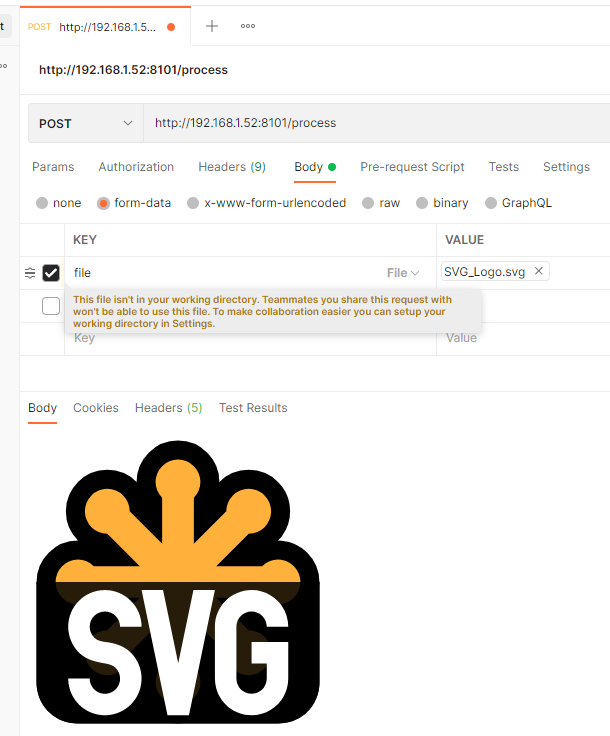

# SVG to PNG converter
[](https://hub.docker.com/r/nokitakaze/svg-export)
[](https://hub.docker.com/r/nokitakaze/svg-export)
[](https://hub.docker.com/r/nokitakaze/svg-export)

HTTP service for rendering SVG to PNG.

## How to use
```sh
git clone https://github.com/nokitakaze/docker-svgexport.git
docker-compose up --build -d
```

And now you could make POST-requests to http://127.0.0.1:8101/process

Use **file type** field with name `file` to put svg-file to the server.
The response is pure png file with rendered image.

Or you could add type `type` with value `json` to get JSON-answer with field `result` with base64-encoded png image.



## Using existing docker image
```yml
version: '2'

services:
  app:
    image: nokitakaze/svg-export
    ports:
      - "127.0.0.1:8101:8080"
```
